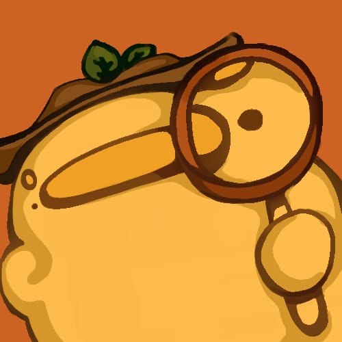

# Projet Sheerduck-Bones

## Protocole d'utilisation
Les programmes ont entièrement été programmés sur __Windows__ : leur fonctionnement sur Linux n'est donc __pas assuré__. Leur provenance (personnelle ou inspirée de travaux déjà créés) est précisée dans le fichier qui leur correspond situé dans le dossier [doc](doc).

### Ouverture du jeu
Pour ouvrir le __jeu__, il suffit simplement d'ouvrir le dossier "sources" et d'exécuter le fichier [main.py](sources/main.py).

### Ouverture de l'éditeur de carte (déconseillé avant d'avoir joué au jeu)
Pour ouvrir l'__éditeur de cartes__, il suffit d'ouvrir le dossier "sources" et d'exécuter le fichier [map_editor.py](sources/map_editor.py). Puis cliquez soit sur le bouton "create new map" et précisez la taille de la carte que vous souhaitez créer. Soit cliquez sur le bouton "continue other map" et entrez le nom "ville", ou tout autre nom présent dans le dossier [map](sources/assets/map/). Vous ouvrirez ainsi une carte pré-existante que vous pourrez modifier.

### Ouverture du séparateur d'images (déconseillé avant d'avoir joué au jeu)
Pour ouvrir le __séparateur d'images__, il suffit d'ouvrir le dossier "sources" et d'exécuter le fichier [split_img.py](sources/split_img.py).